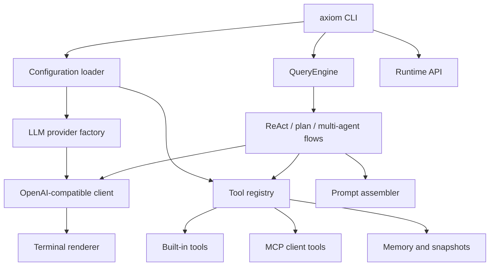

# Axiom Agent Runtime

Axiom Agent Runtime is a lightweight Python terminal AI agent runtime. It combines a CLI, ReAct-style tool use, MCP integration, memory, skills, snapshots, multi-agent orchestration, and a local Runtime API into one small project that is easy to study, run, and extend.

The project is intentionally practical rather than demo-only: it can run as an interactive assistant, execute one-shot prompts, call local tools, connect to MCP servers, and expose runtime primitives for external systems.

## Features

- Terminal CLI powered by Typer, Rich, and prompt-toolkit
- One-shot prompt mode and interactive REPL
- OpenAI-compatible streaming chat completions
- Default DeepSeek-compatible provider configuration
- ReAct agent loop with tool execution
- Built-in workspace, shell, web, memory, skill, code search, and snapshot tools
- Human-in-the-loop command approval policy
- Project and long-term memory support
- Skill discovery through `SKILL.md` files
- MCP client support for stdio and Streamable HTTP servers
- MCP server mode for exposing built-in tools
- Plan-and-execute workflow
- Multi-agent planner, worker, and reviewer orchestration
- Local Runtime API for threads, turns, events, and background tasks
- Image input preprocessing for multimodal-capable providers

## Architecture



Core modules:

- `src/axiom/entrypoints/cli.py`: CLI app, commands, one-shot prompt mode, doctor, MCP, and Runtime API commands
- `src/axiom/entrypoints/repl.py`: interactive REPL and slash commands
- `src/axiom/config.py`: layered configuration loading
- `src/axiom/llm/`: LLM abstraction and OpenAI-compatible client
- `src/axiom/agent/`: query loop, plan-execute, and multi-agent orchestration
- `src/axiom/tools/`: tool model, registry, executor, and built-in tools
- `src/axiom/mcp/`: MCP client, MCP config, and MCP server support
- `src/axiom/memory/`: long-term memory persistence
- `src/axiom/snapshot/`: workspace snapshot service
- `src/axiom/runtime/`: local Runtime API

More detail is available in [`docs/architecture-current.md`](docs/architecture-current.md).

## Requirements

- Python 3.11 or newer
- uv
- A compatible LLM API key for model requests

The CLI can show help and run local diagnostics without making a model request.

## Installation

Clone the repository and install dependencies with uv:

```bash
git clone https://github.com/ZhangYiFan2003/axiom-agent.git
cd axiom-agent
uv sync --extra dev
```

Verify the CLI:

```bash
uv run axiom --help
uv run axiom doctor --cwd .
```

## Configuration

Axiom loads configuration from defaults, user/project config files, `.env`, process environment variables, and CLI overrides. Do not commit local configuration or credentials.

Common environment variables:

```bash
AXIOM_PROVIDER=deepseek
AXIOM_MODEL=deepseek-v4-flash
DEEPSEEK_API_KEY=your_key_here
```

You can also use the generic key name:

```bash
AXIOM_API_KEY=your_key_here
```

Local configuration and state should stay outside Git:

- `.env`
- `.env.*`
- `.axiom/`
- `.venv/`
- `.uv-cache/`

## Usage

Show help:

```bash
uv run axiom --help
```

Run a one-shot prompt:

```bash
uv run axiom -p "Reply with OK"
```

Use plain output mode:

```bash
uv run axiom --plain -p "Summarize this project"
```

Start the interactive CLI:

```bash
uv run axiom
```

Run diagnostics:

```bash
uv run axiom doctor --cwd .
```

Start the local Runtime API:

```bash
AXIOM_RUNTIME_API_KEY=dev-key uv run axiom serve --host 127.0.0.1 --port 8765
```

Manage MCP helpers:

```bash
uv run axiom mcp --help
```

## Development

Install development dependencies:

```bash
uv sync --extra dev
```

Run tests:

```bash
uv run pytest
```

Run linting:

```bash
uv run ruff check .
```

Format code:

```bash
uv run ruff format .
```

## Repository Layout

```text
.
├── docs/                  Architecture and development notes
├── src/axiom/             Python package
│   ├── agent/             ReAct, plan-execute, and multi-agent flows
│   ├── entrypoints/       CLI and REPL entrypoints
│   ├── llm/               LLM provider abstraction
│   ├── mcp/               MCP client and server integration
│   ├── memory/            Long-term memory
│   ├── runtime/           Local Runtime API
│   ├── snapshot/          Workspace snapshots
│   └── tools/             Tool registry and built-in tools
├── tests/                 Pytest test suite
├── pyproject.toml         Package metadata and tool config
└── uv.lock                Locked dependency graph
```

## Security Notes

Axiom can execute tools and shell commands when configured to do so. Review commands before approving them, keep credentials out of the repository, and avoid storing secrets in prompts, logs, or generated documents.

The repository ignores common local and sensitive files, including `.env`, `.env.*`, `.axiom/`, `.venv/`, `.uv-cache/`, private keys, token files, and credential files.

## Roadmap

Near-term engineering work:

- GitHub Actions CI for tests
- README and documentation polish for public users
- First tagged release: `v0.1.0`
- Provider adapters for OpenAI, Anthropic Claude, Ollama, and other local models
- RAG tools for document loading, embedding, retrieval, and agent use
- Runtime API hardening for auth, sessions, and observability
- Docker packaging and deployment examples

## License

MIT License. See [`LICENSE`](LICENSE).
