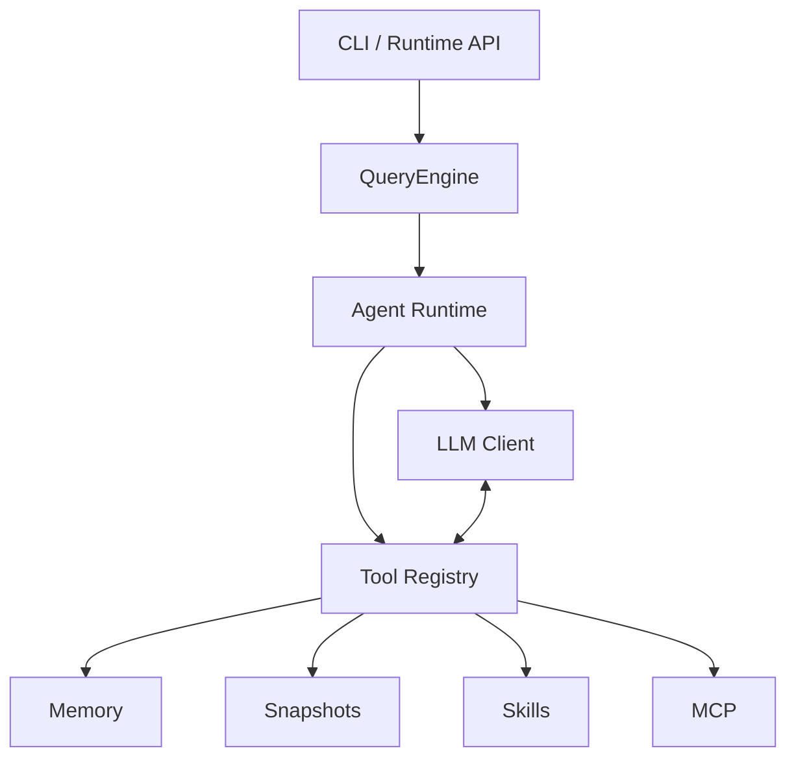

# Axiom Agent Runtime

[](https://github.com/ZhangYiFan2003/axiom-agent/actions/workflows/ci.yml)

A modular Python runtime and CLI for building tool-using AI agents.

Axiom Agent Runtime provides a small but complete foundation for experimenting with terminal agents: a CLI, one-shot prompts, a ReAct loop, tool execution, memory, snapshots, skills, MCP integration, Plan-and-Execute, multi-agent orchestration, and a lightweight Runtime API. The current baseline is designed to be testable without real model calls, external MCP servers, secrets, or user-directory writes.

## Overview

Axiom is organized around a few core paths:

- `axiom` CLI for help, diagnostics, one-shot prompts, REPL entry, MCP helpers, and Runtime API startup.
- `QueryEngine` as the main facade for ReAct, plan execution, and multi-agent flows.
- OpenAI-compatible LLM client abstraction for real provider calls when configured.
- Tool registry and executor for model-requested local tool calls.
- Memory, snapshots, skills, MCP, and Runtime API modules for runtime state and integrations.

The core Agent Runtime paths are covered by offline tests with fake LLM clients. Some integration surfaces, such as MCP server transport lifecycle and live Runtime API serving, are intentionally marked as partially verified until they have stable end-to-end transport tests.

## Features

| Feature | Description | Verification |
| --- | --- | --- |
| CLI command | Typer-based `axiom` command with help, diagnostics, prompt mode, MCP helpers, and Runtime API commands. | Tested |
| One-shot prompt | Runs a single prompt through the configured provider and renderer. | Manual smoke tested |
| ReAct Agent | Executes the loop from model response to tool call, observation, and final answer. | Tested |
| Tool Calling | Merges streamed tool-call deltas, executes registered tools, and replays tool results to the model. | Tested |
| Built-in Tools | Includes file, shell, search, memory, skill, web, AST lexical/vector code search, static symbol/reference lookup, and snapshot tools. | Partially tested |
| Memory | Stores, reads, searches, clears, and isolates scoped long-term memory in SQLite. | Tested |
| Snapshots | Creates, restores, lists, and cleans workspace snapshots under an isolated home in tests. | Tested |
| Skills | Loads built-in, user, and project `SKILL.md` files and supports skill context injection. | Tested |
| Plan-Execute | Parses task DAGs, runs independent tasks in parallel, respects dependencies, and aggregates results. | Tested |
| Multi-Agent | Coordinates planner, worker, and reviewer roles, including retries and worker failure summaries. | Tested |
| MCP Client | Discovers and calls tools from local stdio MCP servers in tests. | Tested |
| MCP Server | Exposes built-in tools through handler-level JSON-RPC requests. | Handler tested |
| Runtime API | Provides task and thread-oriented runtime endpoints; task handler paths are covered. | Handler tested |
| Streaming | Parses OpenAI-compatible streaming events and renders incremental output. | Partially tested |
| REPL | Interactive prompt-toolkit entrypoint and slash commands. | Not fully verified |

## Architecture



Key modules:

- `src/axiom/entrypoints/cli.py`: CLI app, commands, prompt mode, diagnostics, MCP, and Runtime API commands.
- `src/axiom/entrypoints/repl.py`: interactive REPL and slash command handling.
- `src/axiom/config.py`: layered configuration loading.
- `src/axiom/llm/`: LLM protocol, provider factory, and OpenAI-compatible client.
- `src/axiom/agent/`: ReAct query loop, Plan-and-Execute, and multi-agent orchestration.
- `src/axiom/tools/`: tool model, registry, executor, and built-in tools.
- `src/axiom/mcp/`: MCP client, MCP config, and MCP server handler support.
- `src/axiom/memory/`: scoped long-term memory persistence.
- `src/axiom/snapshot/`: workspace snapshot service.
- `src/axiom/runtime/`: local Runtime API and durable task store.

See [`docs/architecture-current.md`](docs/architecture-current.md) for the detailed architecture baseline.

## Requirements

- Python `>=3.11`
- `uv`
- A compatible model provider for real LLM requests
- An API key only when running real model calls

Help, diagnostics, and the default test suite do not require a model provider API key.

## Installation

```bash
git clone https://github.com/ZhangYiFan2003/axiom-agent.git
cd axiom-agent
uv sync --extra dev --locked
```

Verify the CLI without a model request:

```bash
uv run axiom --help
uv run axiom doctor --cwd .
```

## Configuration

For real model requests, configure a provider and API key through environment variables or local ignored configuration.

```env
DEEPSEEK_API_KEY=your-api-key
AXIOM_PROVIDER=deepseek
AXIOM_MODEL=deepseek-v4-flash
```

Do not commit secrets or local state. The repository ignores common sensitive and local files, including:

- `.env`
- `.env.*`
- `.axiom/`
- `.venv/`
- `.uv-cache/`
- private keys, token files, and credential files

Never paste API keys into issues, logs, prompts, or generated documents.

## Usage

Show help:

```bash
uv run axiom --help
```

Run diagnostics without a model request:

```bash
uv run axiom doctor --cwd .
```

Run a one-shot prompt:

```bash
uv run axiom --plain -p "Reply with OK"
```

The one-shot prompt uses the configured provider. It can call an external API and may incur provider costs.

Start the interactive CLI:

```bash
uv run axiom
```

Runtime API and MCP helpers are available from the CLI, but their live transport lifecycle is still treated as partially verified in the current baseline:

```bash
uv run axiom serve --help
uv run axiom mcp --help
```

## Testing

Run the full local test suite:

```bash
uv run pytest
```

Current baseline:

```text
45 tests passing
```

The default tests use fake LLM clients, temporary directories, temporary SQLite databases, and localhost-safe handler paths. They do not require API keys and do not call external model providers.

GitHub Actions runs the same test suite on push and pull request events for `main`.

## Project Status

Verified in the current baseline:

- ReAct loop
- Tool calling
- Memory
- Snapshots
- Skills
- Plan-and-Execute
- Multi-agent orchestration
- MCP client stdio discovery/call path
- Runtime task store and direct API handler paths

Partially verified or intentionally bounded:

- MCP server long-running stdio/http transport lifecycle remains partially verified.
- Runtime API live HTTP server and LLM-backed thread turns remain partially verified.
- Interactive REPL behavior is less extensively covered than non-interactive paths.
- Real provider streaming has manual smoke coverage plus unit-level streaming/rendering paths, but not exhaustive provider matrix coverage.
- Not every built-in tool has a full end-to-end test.

See [`docs/development-baseline.md`](docs/development-baseline.md) for the feature matrix and verification notes.

## Development

Install dependencies:

```bash
uv sync --extra dev --locked
```

Run tests:

```bash
uv run pytest
```

Run linting:

```bash
uv run ruff check .
```

Format code:

```bash
uv run ruff format .
```

## Repository Layout

```text
.
├── .github/workflows/ci.yml
├── docs/
├── src/axiom/
│   ├── agent/
│   ├── entrypoints/
│   ├── llm/
│   ├── mcp/
│   ├── memory/
│   ├── runtime/
│   ├── snapshot/
│   └── tools/
├── tests/
├── pyproject.toml
└── uv.lock
```

## Roadmap

Near-term directions:

- Provider adapter improvements
- Richer MCP transport lifecycle verification
- Runtime API integration testing
- Retrieval and RAG tool support
- Observability for agent runs, tools, and runtime events

No dates are promised; the roadmap is intentionally small so the current verified baseline remains stable.

## License

MIT License. See [`LICENSE`](LICENSE).
