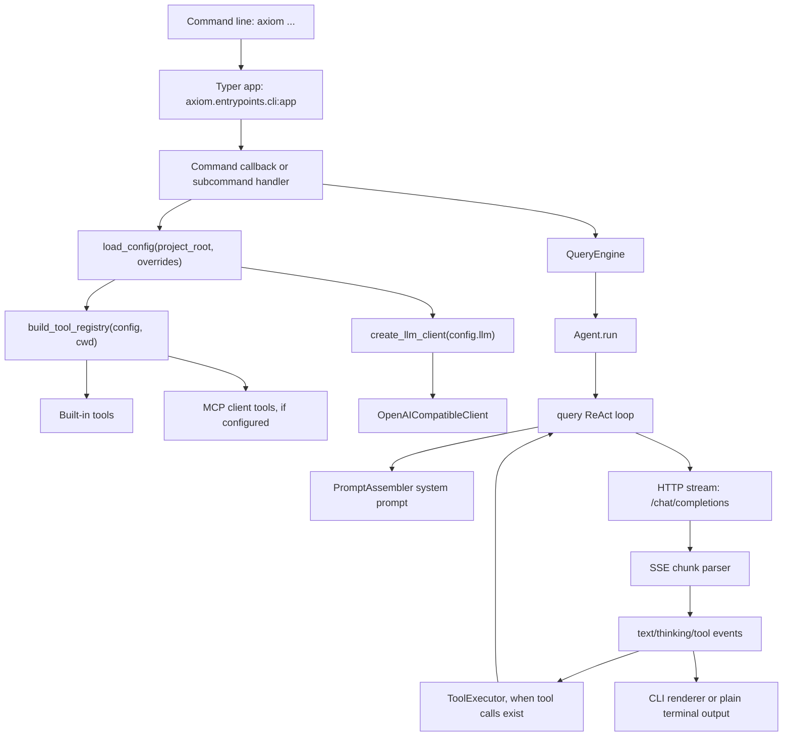

# Current Architecture

## 1. Project overview

Axiom Agent Runtime is a terminal AI agent CLI implemented as a Python package with a
`src` layout. The installed console command is `axiom`, backed by Typer command
registration. It supports an interactive REPL, a one-shot prompt mode, OpenAI
compatible streaming chat completions, function-style tool calling, local
workspace tools, MCP client/server integration, memory, snapshots, planning,
multi-agent orchestration, and a lightweight Runtime API.

Core runtime choices:

- Language: Python 3.11 or newer.
- Package manager: uv.
- Build backend: hatchling.
- CLI framework: Typer.
- Terminal UI: Rich and prompt-toolkit.
- HTTP client: httpx.
- MCP integration: the official `mcp` Python SDK.
- Local persistence: SQLite files under user-level Axiom Agent Runtime state directories.

The default LLM provider is `deepseek`, the default model is
`deepseek-v4-flash`, and the default provider base URL is
`https://api.deepseek.com/v1`. Requests are sent to the OpenAI-compatible
`/chat/completions` endpoint.

## 2. Architecture diagram



## 3. Module responsibilities

### CLI entrypoints

- `pyproject.toml`
  - Defines the console script:
    `axiom = "axiom.entrypoints.cli:app"`.
- `src/axiom/__main__.py`
  - Supports `python -m axiom` by importing and invoking the same Typer app.
- `src/axiom/entrypoints/cli.py`
  - Owns the Typer app, top-level callback, command registration, one-shot
    prompt execution, `doctor`, Runtime API serving, and MCP management
    subcommands.
- `src/axiom/entrypoints/repl.py`
  - Owns interactive prompt-toolkit session setup, slash commands, Rich
    rendering, approval prompts, and REPL command dispatch.

### Configuration

- `src/axiom/config.py`
  - Defines config dataclasses such as `LlmConfig`, `AxiomConfig`,
    `ToolsConfig`, `McpConfig`, `MemoryConfig`, and `PolicyConfig`.
  - `load_config()` merges defaults, user config, project config, project env
    file values, CLI overrides, and process environment variables.
  - `_apply_env()` maps public environment variable names into config fields.
  - `config_to_public_dict()` masks API key values before display.

### LLM

- `src/axiom/llm/base.py`
  - Defines the `LlmClient` protocol. The required method is `chat()`, which
    returns an async stream of normalized event dictionaries.
- `src/axiom/llm/factory.py`
  - `create_llm_client()` selects an LLM client based on `LlmConfig.provider`.
  - Contains default provider base URLs and known model context windows.
- `src/axiom/llm/openai_compatible.py`
  - Implements `OpenAICompatibleClient`.
  - Formats messages and tool definitions into an OpenAI-compatible payload.
  - Streams HTTP responses with httpx and parses SSE chunks into internal
    events such as `text_delta`, `thinking_delta`, `tool_call_delta`, `usage`,
    and `message_end`.

### Agent and request lifecycle

- `src/axiom/agent/query_engine.py`
  - Provides the high-level `QueryEngine` facade used by CLI, SDK, and Runtime
    API.
  - Builds the system prompt once for the engine and exposes ReAct, plan, and
    team execution modes.
- `src/axiom/agent/agent.py`
  - Wraps one ReAct run with pre-turn and post-turn snapshots.
  - Stores conversation history after a completed turn.
- `src/axiom/agent/query.py`
  - Implements the core ReAct loop.
  - Creates the user message, passes messages/tools/system prompt to the LLM,
    accumulates assistant text, merges streaming tool-call deltas, executes
    tools, appends tool results, and repeats until the model finishes or the
    max turn limit is reached.
- `src/axiom/agent/plan_execute.py`
  - Implements Plan-and-Execute. A planner creates a DAG, then executable tasks
    run in dependency order with parallel batches when possible.
- `src/axiom/agent/orchestrator.py`
  - Implements a multi-agent workflow with planner, worker, and reviewer roles.
  - Workers can use tools; planner and reviewer run without tools.

### Prompting

- `src/axiom/prompt/assembler.py`
  - Builds the system prompt from runtime context, working directory, model,
    provider, available tool names, project memory files, long-term memory, and
    the skill index.

### Tools

- `src/axiom/tools/base.py`
  - Defines `Tool`, `ToolContext`, `ToolResult`, and JSON schema helpers.
- `src/axiom/tools/registry.py`
  - Stores tools by name and exports OpenAI-compatible tool definitions.
- `src/axiom/tools/executor.py`
  - Executes model-requested tool calls.
  - Runs read-only concurrency-safe calls in parallel and state-changing calls
    sequentially.
  - Applies HITL approval rules and audit logging for non-read-only actions.
- `src/axiom/tools/builtins.py`
  - Registers built-in workspace, shell, web, memory, skill, code search, and
    snapshot restore tools.

### Code intelligence

- `src/axiom/rag/code_index.py`
  - Public facade for AST indexing, lexical/vector/hybrid search, symbol
    lookup, call-graph queries, and graph-aware context assembly.
- `src/axiom/rag/context.py`
  - Builds deterministic code context from search seeds, unique symbol
    mentions, definitions, direct references, direct callers/callees, and
    bounded incoming/outgoing call paths.
  - Enforces local character, token-estimate, seed, depth, and item hard limits.
  - Preserves workspace-relative paths, reason labels, graph distance, budget
    usage, and stable ordering for agent consumption.
- `src/axiom/rag/store.py`
  - Persists indexed files, AST chunks, FTS5 rows, embedding profiles, vector
    embeddings, symbol definitions/imports/references, and exact call edges in
    SQLite schema version 6.
- `src/axiom/rag/call_graph.py`
  - Builds the conservative static call graph and implements callers, callees,
    bounded call paths, and recursive component analysis.

### MCP

- `src/axiom/mcp/config.py`
  - Loads MCP server specs from user and project MCP config locations.
  - Can write Chrome DevTools MCP config through the CLI helper.
- `src/axiom/mcp/client.py`
  - Connects to stdio and Streamable HTTP MCP servers.
  - Discovers remote tools and wraps them as local Axiom Agent Runtime tools named
    `mcp__<server-name>__<tool-name>`.
  - Adds virtual resource and prompt tools for each MCP server.
- `src/axiom/mcp/server.py`
  - Exposes Axiom Agent Runtime built-in tools as a small JSON-RPC MCP-like server over
    stdio or local HTTP.

### Memory, skills, snapshots, policy, and runtime

- `src/axiom/memory/manager.py`
  - Stores scoped long-term memory in SQLite.
- `src/axiom/skill/registry.py`
  - Loads built-in, user, and project `SKILL.md` files and tracks disabled
    skills.
- `src/axiom/snapshot/service.py`
  - Creates and restores pre-turn/post-turn workspace snapshots.
- `src/axiom/policy/path_guard.py`
  - Restricts file tools to the workspace tree.
- `src/axiom/policy/command_guard.py`
  - Rejects obviously destructive shell commands before approval.
- `src/axiom/policy/audit_log.py`
  - Writes JSONL audit entries with sensitive input fields redacted.
- `src/axiom/runtime/api.py`
  - Provides a local Runtime API for threads, turns, events, and background
    tasks.
- `src/axiom/runtime/tasks.py`
  - Stores durable background tasks in SQLite.

## 4. CLI execution flow

### Console script flow

Input:

```text
axiom xxx
```

Flow:

```text
command line
-> pyproject console script
-> axiom.entrypoints.cli:app
-> Typer parses options and subcommands
-> callback or command handler
-> configuration, LLM, tools, agent, or service logic
-> terminal output
```

Main entry files and functions:

- `pyproject.toml`
  - Input: installed `axiom` command.
  - Output: imports `axiom.entrypoints.cli:app`.
- `src/axiom/entrypoints/cli.py`
  - `app`: Typer application.
  - `main()`: top-level callback for prompt mode and REPL mode.
  - `doctor()`: local environment/config diagnostic command.
  - `runtime_serve()`: starts the Runtime API.
  - `mcp_serve()`, `mcp_init_chrome()`, `mcp_list()`: MCP commands.
- `src/axiom/entrypoints/repl.py`
  - `start_repl()`: starts interactive mode when no prompt or subcommand is
    provided.

### `axiom --plain -p "hello"` flow

```text
User input
-> Typer callback main(prompt="hello", plain=True)
-> root cwd resolution
-> CLI override dict for render mode/model/provider
-> load_config(project_root=root, overrides=overrides)
-> _run_prompt(prompt, cwd, config)
-> API key presence check
-> build_tool_registry(config, cwd)
-> create_llm_client(config.llm)
-> QueryEngine(...)
-> QueryEngine.ask_complete_async(prompt)
-> Agent.run(prompt)
-> SnapshotService.create("pre-turn")
-> query(...)
-> llm_client.chat(messages, tools, system_prompt)
-> HTTP stream to provider
-> parse SSE chunks
-> collect text_delta events
-> execute tool calls if model requests tools
-> final done event
-> SnapshotService.create("post-turn")
-> return QueryResult
-> typer.echo(result.text)
```

Inputs and outputs:

- CLI input: user-provided options and prompt text.
- Config input: defaults, config files, project env file values, CLI overrides,
  and process environment values.
- LLM input: `messages`, OpenAI-compatible `tools`, and `system_prompt`.
- LLM output: streamed SSE chunks.
- Internal normalized output: event dictionaries.
- CLI output: final text printed to stdout in plain mode.

## 5. LLM request flow

Data structures:

- `LlmConfig`
  - Provider, model, API key presence, base URL, max tokens, temperature, and
    timeout.
- `Message`
  - Role, content, optional name, optional tool call id, and assistant tool
    calls.
- `QueryResult`
  - Final text, total token count, and total turn count.

Request construction:

1. `PromptAssembler.build()` creates the system prompt.
2. `ToolRegistry.definitions()` exports tool schemas.
3. `query()` builds a `Message(role="user", content=...)`.
4. `OpenAICompatibleClient.chat()` builds the payload:
   - `model`
   - formatted `messages`
   - `stream: true`
   - `max_tokens`
   - `temperature`
   - optional `tools`
   - optional `tool_choice: auto`
5. The client posts to:
   `base_url.rstrip("/") + "/chat/completions"`.

Response parsing:

1. `_iter_sse()` extracts `data:` events from the HTTP response stream.
2. `_parse_chunk()` maps provider chunks into internal events.
3. `query()` accumulates text, tool call deltas, stop reason, and usage.
4. If tool calls exist, `ToolExecutor.execute_all()` runs them and appends tool
   results as `role="tool"` messages.
5. The loop repeats until the model stops without tool calls or max turns are
   reached.

## 6. Configuration system

Configuration sources:

1. Built-in dataclass defaults.
2. User config file at `~/.axiom/config.json`.
3. Project config file at `.axiom/config.json`.
4. Project env file at `.env`.
5. CLI overrides from options such as `--provider`, `--model`, and `--plain`.
6. Current process environment variables.

Effective precedence:

```text
defaults
-> user config
-> project config
-> project env file
-> CLI overrides
-> process environment
```

Configuration files may contain local private values. This document only records
the supported locations and precedence. It does not include credential values.

Relevant environment variable names:

- `AXIOM_API_KEY`
- `AXIOM_PROVIDER`
- `AXIOM_MODEL`
- `AXIOM_BASE_URL`
- `AXIOM_MAX_TOKENS`
- `AXIOM_TEMPERATURE`
- `AXIOM_RENDER_MODE`
- `AXIOM_RENDERER`
- `AXIOM_TUI`
- `AXIOM_MCP`
- `AXIOM_SKILL`
- `AXIOM_MEMORY`
- `AXIOM_HITL`
- Provider-specific API key variables are mapped by provider name.

## 7. Extension points

### Adding an OpenAI-compatible provider

If the provider follows the OpenAI chat completions API, add or adjust provider
handling in `src/axiom/llm/factory.py`:

- Add a provider base URL to `PROVIDER_BASE_URLS`, or add a provider-specific
  branch in `create_llm_client()`.
- Add context window metadata if needed.
- Add provider-specific API key mapping in `src/axiom/config.py`.
- Optionally document the provider in README or config docs.

### Adding OpenAI

OpenAI is already routed through the `openai`, `openai-compatible`, and
`compatible` provider branch in `create_llm_client()`. A production-ready
addition would mainly document model names, base URL behavior, and environment
variable expectations.

### Adding Claude

Claude is not OpenAI-compatible by default. A direct provider would likely need:

- A new client implementation under `src/axiom/llm/`.
- A common event stream contract matching `LlmClient.chat()`.
- Factory routing in `create_llm_client()`.
- Message and tool schema translation between Axiom Agent Runtime's internal structures and
  Claude's API.
- Provider-specific configuration mapping.

### Adding Ollama or another local model

If using an OpenAI-compatible local endpoint, existing
`openai-compatible` support can work with `AXIOM_BASE_URL` and `AXIOM_MODEL`.
If using a non-compatible endpoint, add a new `LlmClient` implementation and
factory route.

### Adding tools

Built-in tools are added in `src/axiom/tools/builtins.py`. Each tool needs:

- Name.
- Description.
- JSON schema parameters.
- Required keys.
- Async handler.
- Read-only/concurrency/approval metadata.

Tool execution behavior is centralized in `ToolExecutor`.

### Adding MCP support

MCP client expansion points:

- `src/axiom/mcp/config.py` for config schema and server spec loading.
- `src/axiom/mcp/client.py` for transports, discovery, and wrapper behavior.
- `src/axiom/bootstrap.py` for registration into the active tool registry.

MCP server expansion points:

- `src/axiom/mcp/server.py` for JSON-RPC methods and exposed tool behavior.

## 8. Current limitations

- The only concrete LLM client implementation is OpenAI-compatible streaming
  chat completions. Non-compatible providers need new client adapters.
- The one-shot CLI prompt path does not provide an interactive approval callback,
  so tools requiring approval are denied unless policy/configuration changes
  allow them.
- The MCP server implementation exposes tools/list and tools/call style methods
  but is minimal compared with a full-featured MCP server implementation.
- Project/user configuration can contain secrets; architecture tools and reports
  should treat these files as sensitive and avoid reading their contents unless
  explicitly requested.
- Runtime API persistence is local SQLite and bound to localhost; it is not a
  distributed service.
- Snapshot restore can overwrite workspace files and should be treated as a
  destructive capability.
- Terminal text in some files appears to contain encoding artifacts, which may
  affect display quality but is separate from the request lifecycle.

